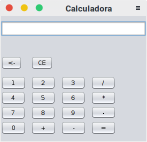

# Uma simples calculadora feita em java

## Como foi feito

<p>Na elaboração do projeto utilizei a IDE netbeans, apenas por escolha pessoal, e para criação da interface gráfica utilizei a biblioteca swing do Java.</p>
<p>Esse projeto é um daqueles projetos que você faz para ir começando a dar os primeiros passos na criação de programas e buscando tomar conhecimento do que a linguagem Java oferece, e como tem a oferecer :).</p>

## Como executar

<p>O  jeito mais simples é criar um projeto no netbeans e adicionar os devidos pacotes da pasta "src/". Outro jeito de executar é através do terminal com a instrução abaixo:</p>

``` bash
$ java -jar dist/Calculadora.jar
```


